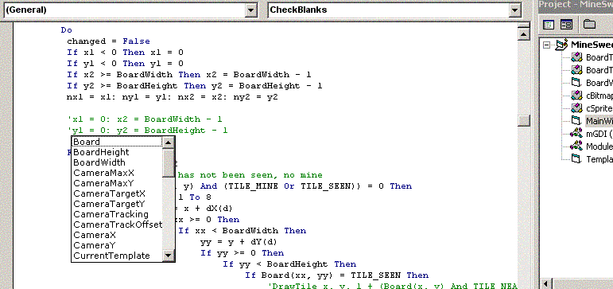

## Howto : Never forget your variables again \[my take\]

### Description

To judge from some recent submissions, some people forget their variables!

 

This is my take on how to avoid this, by making an IDE addin that shows a list of your private variables when you press a hotkey (Ctrl+m).

 

It's not perfect, but it could be a good starting point for other IDE enhancements, if anyone's interested :)
 
### More Info
 

             |
---                |---
**Submitted On**   |2004-03-18 12:35:04
**By**             |[grigri](https://github.com/Planet-Source-Code/PSCIndex/blob/master/ByAuthor/grigri.md)
**Level**          |Intermediate
**User Rating**    |4.8 (19 globes from 4 users)
**Compatibility**  |VB 6\.0
**Category**       |[Debugging and Error Handling](https://github.com/Planet-Source-Code/PSCIndex/blob/master/ByCategory/debugging-and-error-handling__1-26.md)
**World**          |[Visual Basic](https://github.com/Planet-Source-Code/PSCIndex/blob/master/ByWorld/visual-basic.md)
**Archive File**   |[Howto\_\_\_Ne1721483182004\.zip](https://github.com/Planet-Source-Code/grigri-howto-never-forget-your-variables-again-my-take__1-52453/archive/master.zip)

